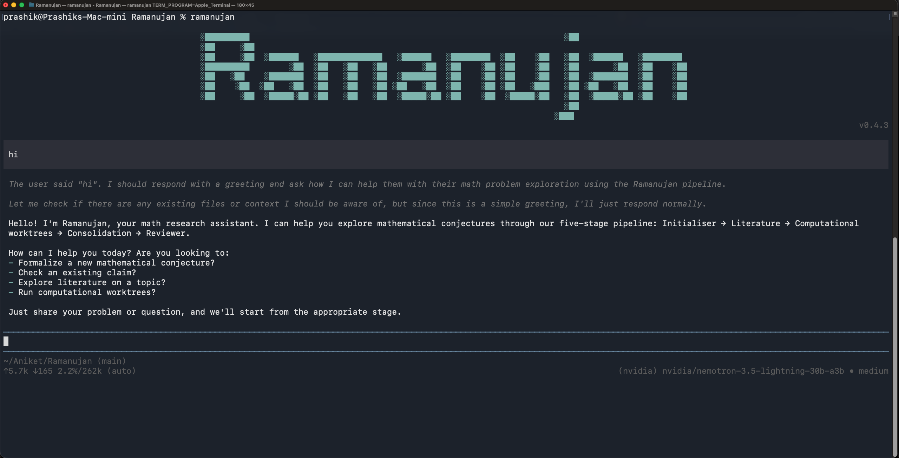
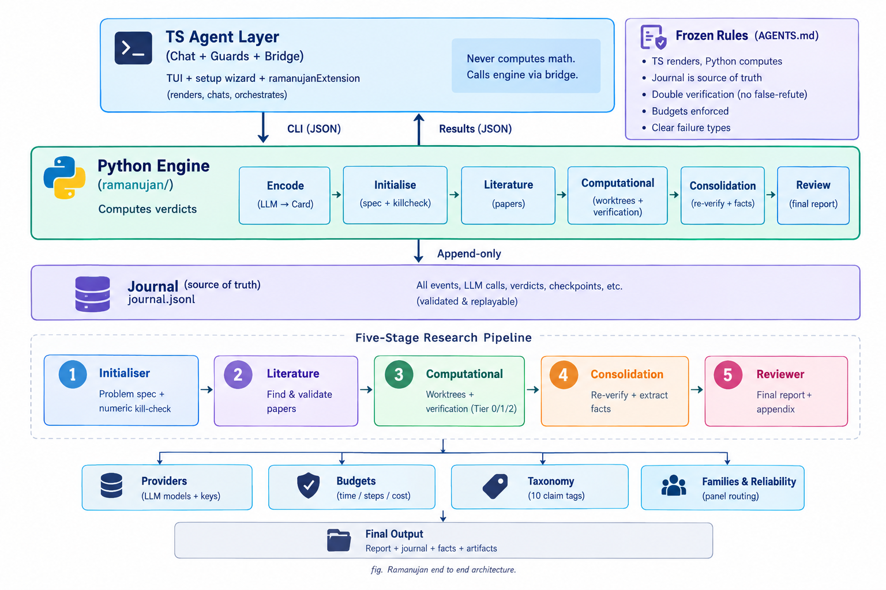

<h1 align="center">
  <a href="#"></a> Ramanujan
</h1>

<p align="center">
  <strong>Multi Model Agentic Workbench for Research in Computational Mathematics</strong>
</p>

<p align="center">
  
  
  
  <a href="LICENSE"></a>
</p>


<p align="center">
  
</p>

Ramanujan is a terminal based multi model agentic workbench for research in computational mathematics.

It is a free tool to help with research in maths. You can chat normally and when you want to dig deeper it structures your problem, surveys the literature, runs parallel subagents and brings back a consolidated report. Everything runs locally and every verdict is computed deterministically.

---

## System Architecture

<p align="center">
  
</p>

---

> **Disclaimer:** This project is still under active development. If you find any bugs, issues, or have suggestions, please open an issue on the [GitHub Issues page](https://github.com/AniketWathore/Ramanujan/issues).

## Features

- **Multi-model parallel subagents** — spawn N subagents on different models at once, with live progress and contradiction flagging.
- **Isolated worktrees** — each run gets its own worktree with local journal, budgets, and stall detection.
- **Multiple providers & models** — mix any OpenAI-compatible providers, multi-pick models, save them as presets.
- **Verified literature survey** — every source carries a real URL or an explicit `model-memory, unverified` tag.
- **Deterministic checking** — SymPy + Z3 kill-check with independent double-verification; cross-provider panel only advises where no check applies.
- **Checkpoints & consolidated report** — confirm / revise at every stage, then get a plain-language report with technical appendix.

---

## Workflow

### 1. First Launch — Setup in the TUI

Open `ramanujan` with an empty config → provider picker → API key → main-model picker → computational pool (existing or new providers, multi-pick models) → save preset → confirm → home screen. Zero commands.

### 2. Research — Just Ask

Type a problem in chat ("Goldbach's Conjecture: Every even integer >2 is sum of two primes — prove it"). The agent structures it, shows the spec, and waits for your confirm / revise / typed feedback before the next stage.

### 3. Literature — Verify, Then Continue

Sources, data, and related work land in a text store; you see the important entries, verify them, confirm-and-continue or type what to change.

### 4. Computational — Parallel Subagents

Pick the preset (or providers/models manually) and the headcount. Subagents work in parallel with live progress, shared orchestration files, cross-help, and contradiction flagging — then one consolidated findings report.

---

## Requirements

| Requirement | Details |
|:------------|:--------|
| **OS** | macOS (tested), Linux |
| **Runtime** | Node.js 22+ |
| **Package Manager** | npm |
| **Python** | 3.12+ (math engine: SymPy, Z3, Pydantic) |
| **LLM access** | At least one provider API key (any OpenAI-compatible endpoint) |

---

## Tech Stack

<p>
  <a href="https://www.typescriptlang.org/"></a>
  <a href="https://nodejs.org/"></a>
  <a href="https://www.python.org/"></a>
  <a href="https://www.sympy.org/"></a>
  <a href="https://github.com/Z3Prover/z3"></a>
  <a href="https://docs.pydantic.dev/"></a>
</p>

TypeScript TUI agent on the pi substrate (vendored) + frozen Python math engine spawned as a subprocess. The agent renders; only the engine computes.

---

## Installation

```bash
# Clone
git clone https://github.com/AniketWathore/Ramanujan.git
cd Ramanujan

# Install (builds the agent, installs the `ramanujan` bin globally,
# puts `ramanujan-engine` on PATH — never touches any pi install)
./scripts/install.sh
```

Fresh machine, no checkout handy? The script is self-contained — prerequisites are just Node 22+, npm, and Python 3.12+.

### First-Time Setup

Run `ramanujan` with an empty config — the setup wizard starts automatically:

1. Pick a provider from the list.
2. Paste your API key.
3. Pick your main model from the live list.
4. Build your computational pool (reuse providers or add new ones, multi-pick models).
5. Save it as the default preset and confirm — you land on the home screen.

---

## Usage — TUI Only

```bash
ramanujan
```

That's it. First launch opens the setup wizard; afterwards you land on the ASCII home + chatbox. Talk like a normal chatbot, or ask it to research something and follow the checkpoints. To re-run setup any time, remove the config and relaunch:

```bash
mv ~/.config/ramanujan/config.toml ~/ramanujan-config.bak && ramanujan
```

---

## Troubleshooting

| Symptom | Fix |
|---|---|
| Chat footer shows a different model than the setup pick | Re-run setup (command above) — the pick is now written once and never overwritten by pool providers; `/model` still switches anytime |
| Setup text invisible / wrong colours | Fixed — the wizard queries the real terminal background before the first screen; update with `git pull` + `./scripts/install.sh` |
| `ramanujan` opens pi, or pi opens Ramanujan | Fixed — separate bins (`ramanujan` vs `pi`) and separate dirs (`~/.ramanujan` vs `~/.pi`); reinstall both cleanly and the collision is gone |
| Setup keeps re-appearing | Config isn't persisting — check `~/.config/ramanujan/config.toml` exists (`0600`); skip once with `RAMANUJAN_NO_SETUP=1 ramanujan` |
| No models listed for a provider | The wizard falls back to the built-in catalog, then manual slug entry — any of the three works |

---

## Verification Checklist

```bash
uv run pytest -q            # 153 passed — engine: journal, killcheck, stages, calibration
uv run ruff check .         # clean
npm run test --prefix agent/packages/bridge       # 20 passed
npm run test --prefix agent/packages/config       # 18 passed
npm run test --prefix agent/packages/math-tools   # 33 passed
./scripts/install-obscura.sh # minimal no-render obscura 45M+40M, tools/obscura/bin/obscura --version
tools/obscura/bin/obscura fetch https://example.com --dump text  # Example Domain
uv run python -m ramanujan.obscura_client  # is_available() true
# Manual:
# 1. Fresh config → `ramanujan` → wizard → home + chat, zero commands
# 2. Research prompt → spec card → confirm → literature (arXiv+Scholar+websites via Obscura, per-category text) → confirm → worktrees → report
# 3. `pi --version` still genuine; `~/.pi` untouched
```

---

## Acknowledgements

- [pi agent](https://github.com/badlogic/pi-mono) (MIT) — TUI substrate, vendored verbatim except the documented fork diffs.
- [Obscura](https://github.com/h4ckf0r0day/obscura) (Apache-2.0) — minimal headless browser (`fetch --dump markdown`, no-render) bundled at `tools/obscura/bin/obscura` for literature web collection (papers, books, websites, blogs, articles, discussions as text).
- [SymPy](https://www.sympy.org/) and [Z3](https://github.com/Z3Prover/z3) — the deterministic math backend.
- Srinivasa Ramanujan — the name, and the standard.

---

## License

Distributed under the [MIT License](LICENSE). See [`LICENSE`](LICENSE) for more information.
