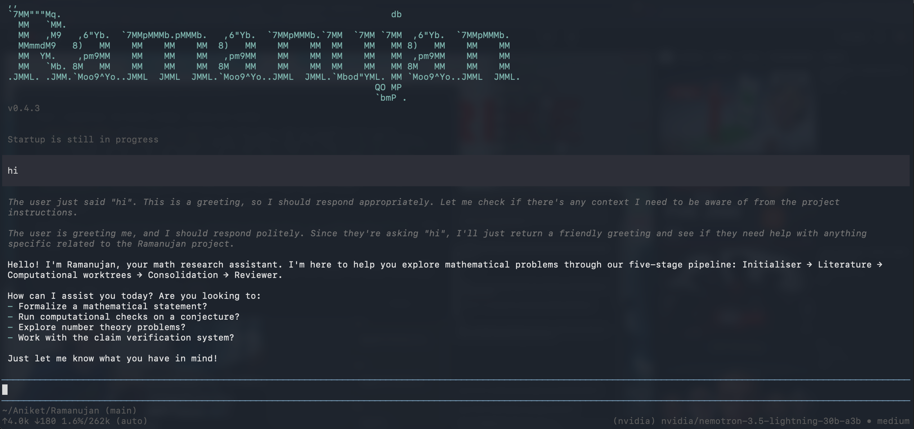

<h1 align="center">
  <a href="#"></a> Ramanujan
</h1>

<p align="center">
  <strong>Terminal math research assistant. Chat normally — it runs a five-stage research pipeline when you ask.</strong>
</p>

<p align="center">
  <a href="https://github.com/AniketWathore/Ramanujan"></a>
  <a href="LICENSE"></a>
  
  
</p>

<p align="center">
  
</p>

Ramanujan is a terminal based multi model agentic workbench for research in computational mathematics.

It is a free tool to help with research in maths. You can chat normally and when you want to dig deeper it structures your problem, surveys the literature, runs parallel subagents and brings back a consolidated report. Everything runs locally and every verdict is computed deterministically.

---

> **Disclaimer:** This project is still under active development. If you find any bugs, issues, or have suggestions, please open an issue on the [GitHub Issues page](https://github.com/AniketWathore/Ramanujan/issues).

## All Features

### First-Launch Setup Wizard

Pick a provider from the known list (like `/login` — no base URLs, no family questions) → paste just the API key → pick the main model from the live model list (like `/models`) → build the computational pool from existing or new providers → save it as the default preset (more presets optional) → confirm → ASCII home + chat. Runs automatically on first launch; skips cleanly when already configured.

### Five-Stage Research Pipeline

**Initialiser** structures the problem (`problem_spec.json`: domain, variables, objective, known cases — never a ClaimCard gate) and shows it for confirm/revise. **Literature** fetches real sources (every entry carries a `source_url` or an explicit `model-memory, unverified` tag) into a text store you verify before continuing. **Computational** spawns N parallel subagents (preset or manual provider/model picks), each self-verifying inline with shared orchestration files. **Consolidation** independently re-checks and labels every fact. **Reviewer** writes the plain-language report + technical appendix (failed approaches included, never omitted).

### Checkpoints, Not Commands

Every stage ends in an interactive picker: **confirm-and-continue / revise / type-your-response** (Claude-Code style). Timeout defaults are applied, logged, and resurfaced unmissably at Checkpoint C. Stop is always available and never destroys completed work.

### Cross-Provider Panel with Teeth

Sealed round 1 → engine-verify funnel → open round 2 → deterministic advisory. The panel can grant `panel-verified` **only** where no deterministic check applies, and only from a different model family than the caller (vendor relabels map to one family, so the independence guarantee can't be gamed).

### Independent from pi

Own `ramanujan` binary, own `~/.ramanujan` agent dir (auth, settings, sessions), own `~/.config/ramanujan` config. Installing or running Ramanujan never touches a pi install — bins, keys, models, and sessions stay separate.

**Also in the box:**

- **Single-writer journal** — every event (both runtimes) appends through one path; replay validates the frozen schema.
- **Per-worktree budgets** — time/step/cost caps end runs with `stopped_budget`, a logged outcome, not an error.
- **Toolchain pinning** — formal artifacts record exact Lean/Mathlib versions; upgrades flag mismatches instead of silently re-checking.
- **Reliability table** — per claim-structure tag, fed by every panel call, with perturbation audits feeding back into routing.

---

## Workflow

### 1. First Launch — Setup in the TUI

Open `ramanujan` with an empty config → provider picker → API key → main-model picker → computational pool (existing or new providers, multi-pick models) → save preset → confirm → home screen. Zero commands.

### 2. Research — Just Ask

Type a problem in chat ("Goldbach's Conjecture: Every even integer >2 is sum of two primes — prove it"). The agent structures it, shows the spec, and waits for your confirm / revise / typed feedback before the next stage.

### 3. Literature — Verify, Then Continue

Sources, data, and related work land in a text store; you see the important entries, verify them, confirm-and-continue or type what to change.

### 4. Computational — Parallel Subagents

Pick the preset (or providers/models manually) and the headcount. Subagents work in parallel with live progress, shared orchestration files, cross-help, and contradiction flagging — then one consolidated findings report.

---

## Requirements

| Requirement | Details |
|:------------|:--------|
| **OS** | macOS (tested), Linux |
| **Runtime** | Node.js 22+ |
| **Package Manager** | npm |
| **Python** | 3.12+ (math engine: SymPy, Z3, Pydantic) |
| **LLM access** | At least one provider API key (any OpenAI-compatible endpoint) |

---

## Tech Stack

<p>
  <a href="https://www.typescriptlang.org/"></a>
  <a href="https://nodejs.org/"></a>
  <a href="https://www.python.org/"></a>
  <a href="https://www.sympy.org/"></a>
  <a href="https://github.com/Z3Prover/z3"></a>
  <a href="https://docs.pydantic.dev/"></a>
</p>

TypeScript TUI agent on the pi substrate (vendored) + frozen Python math engine spawned as a subprocess. The agent renders; only the engine computes.

---

## Installation

```bash
# Clone
git clone https://github.com/AniketWathore/Ramanujan.git
cd Ramanujan

# Install (builds the agent, installs the `ramanujan` bin globally,
# puts `ramanujan-engine` on PATH — never touches any pi install)
./scripts/install.sh
```

Fresh machine, no checkout handy? The script is self-contained — prerequisites are just Node 22+, npm, and Python 3.12+.

---

## Usage — TUI Only

```bash
ramanujan
```

That's it. First launch opens the setup wizard; afterwards you land on the ASCII home + chatbox. Talk like a normal chatbot, or ask it to research something and follow the checkpoints. To re-run setup any time, remove the config and relaunch:

```bash
mv ~/.config/ramanujan/config.toml ~/ramanujan-config.bak && ramanujan
```

---

## Troubleshooting

| Symptom | Fix |
|---|---|
| Chat footer shows a different model than the setup pick | Re-run setup (command above) — the pick is now written once and never overwritten by pool providers; `/model` still switches anytime |
| Setup text invisible / wrong colours | Fixed — the wizard queries the real terminal background before the first screen; update with `git pull` + `./scripts/install.sh` |
| `ramanujan` opens pi, or pi opens Ramanujan | Fixed — separate bins (`ramanujan` vs `pi`) and separate dirs (`~/.ramanujan` vs `~/.pi`); reinstall both cleanly and the collision is gone |
| Setup keeps re-appearing | Config isn't persisting — check `~/.config/ramanujan/config.toml` exists (`0600`); skip once with `RAMANUJAN_NO_SETUP=1 ramanujan` |
| No models listed for a provider | The wizard falls back to the built-in catalog, then manual slug entry — any of the three works |

---

## Verification Checklist

```bash
uv run pytest -q            # 153 passed — engine: journal, killcheck, stages, calibration
uv run ruff check .         # clean
npm run test --prefix agent/packages/bridge       # 20 passed
npm run test --prefix agent/packages/config       # 18 passed
npm run test --prefix agent/packages/math-tools   # 33 passed
# Manual:
# 1. Fresh config → `ramanujan` → wizard → home + chat, zero commands
# 2. Research prompt → spec card → confirm → literature → confirm → worktrees → report
# 3. `pi --version` still genuine; `~/.pi` untouched
```

---

## Acknowledgements

- [pi agent](https://github.com/badlogic/pi-mono) (MIT) — TUI substrate, vendored verbatim except the documented fork diffs.
- [SymPy](https://www.sympy.org/) and [Z3](https://github.com/Z3Prover/z3) — the deterministic math backend.
- Srinivasa Ramanujan — the name, and the standard.

---

## License

Distributed under the [MIT License](LICENSE). See [`LICENSE`](LICENSE) for more information.
